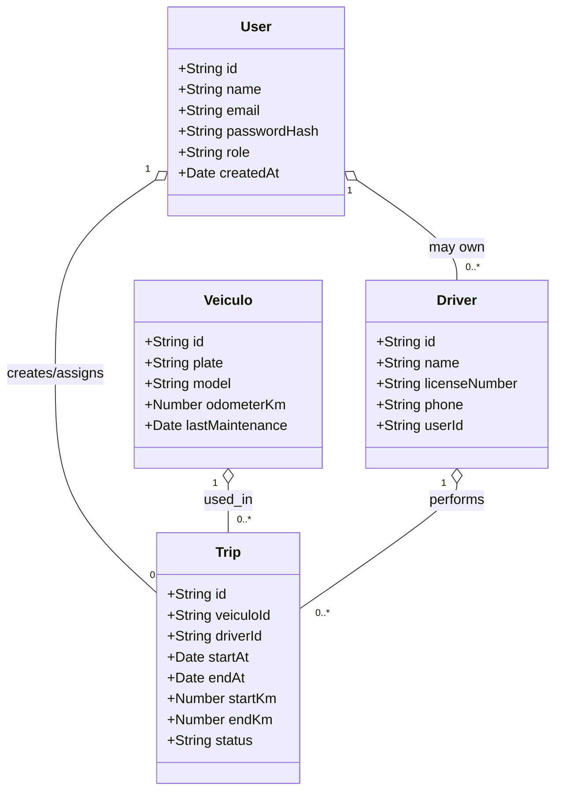
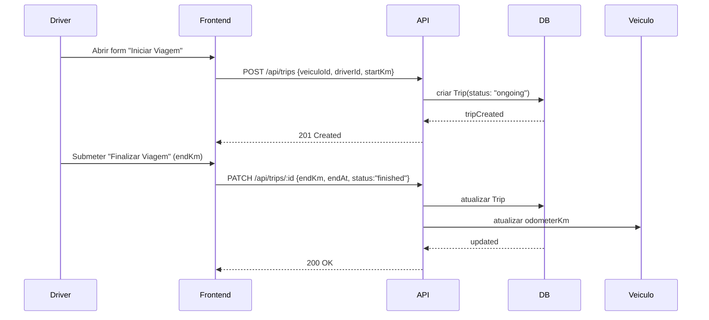
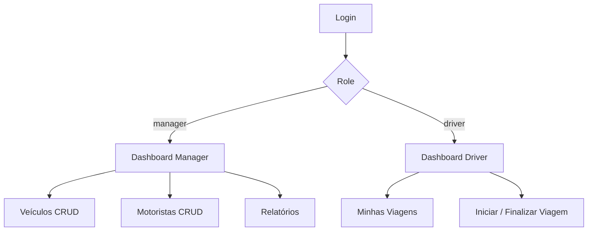

# SGM - LogiMax (MVC)

Aplicação MVC pronta com Express + EJS + MongoDB para gerenciar veículos, motoristas e viagens.

Resumo rápido
- Autenticação por sessão (express-session + connect-mongo)
- Roles: manager, driver
- CRUD: Veículos, Motoristas, Viagens
- Motorista finaliza viagem e atualiza km do veículo
- Alertas de manutenção a cada 10.000 km
- Views EJS (pasta /views) e CSS em /public/css
- Script de seed com dados de exemplo

Requisitos
- Node.js 16+
- MongoDB (URI disponível em .env)

Instalação e execução (Windows)
1. Copie o projeto para sua máquina.
2. Abra terminal no diretório do projeto.
3. Instale dependências:
   - npm install
4. Crie o arquivo .env a partir do exemplo:
   - Windows (CMD): copy .env.example .env
   - Git Bash / PowerShell: cp .env.example .env
5. Ajuste variáveis em .env (ex.: MONGO_URI, SESSION_SECRET, PORT).
6. Popular dados de exemplo:
   - npm run seed
   (cria theDhalia@gerente.com / acheron@motorista.com — senha: password)
7. Rodar em modo dev ou produção:
   - npm run dev
   - npm start
8. Abrir no navegador:
   - http://localhost:3011 (ou PORT definido em .env)

Variáveis .env (exemplos)
- MONGO_URI=mongodb://localhost:27017/logimax
- SESSION_SECRET=sua_chave_segura
- PORT=3011

Scripts úteis
- npm run seed — popula banco com dados de exemplo
- npm run dev — roda em modo desenvolvimento (com nodemon)
- npm start — inicia em modo produção

Design
- Link do protótipo: https://www.figma.com/design/fpBodWKN72kXf5rWEKqXFK/CineFavorite-Frotas?node-id=56-19&t=ARfuRUV1VSWPjIhC-1

---
# Avaliação Somativa — Desenvolvimento de Soluções Corporativas Full-Stack
Competências desenvolvidas
- Full-Stack (Next.js App Router ou adaptação do backend atual)
- Modelagem com Mongoose
- APIs RESTful seguras
- Autenticação/Autorização (JWT / roles)
- SCSS e arquitetura de estilos
- Análise de requisitos, modelagem e apresentação

Diagrams (Mermaid)
> Nota: para visualizar os diagramas aqui, use um renderizador Mermaid (GitHub, VS Code Markdown Preview Enhanced ou plugin).

## Diagrama de Classes


## Diagrama de Casos de Uso
```mermaid
{init: {"theme":"default"}}%%
usecaseDiagram
  actor Manager
  actor Driver
  Manager --> (Login)
  Driver --> (Login)
  Manager --> (Gerenciar Veículos)
  Manager --> (Gerenciar Motoristas)
  Manager --> (Visualizar Relatórios)
  Driver --> (Iniciar Viagem)
  Driver --> (Finalizar Viagem)
  (Finalizar Viagem) <-- Manager : pode validar
```

## Diagrama de Fluxo (Sequência) — Criar e Finalizar Viagem


## Fluxo de navegação (Protótipos / Páginas principais)


Exemplo de estrutura de arquivos sugerida (Mínima)
- /models — Mongoose schemas
- /routes or /api — endpoints
- /controllers — lógica
- /views or /app — páginas (EJS ou Next.js)
- /public — assets, css/scss
- /scripts — seed, migracoes


